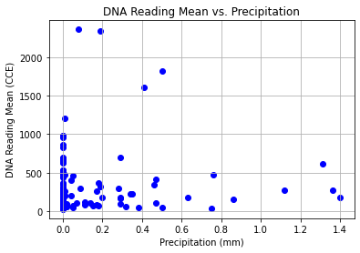
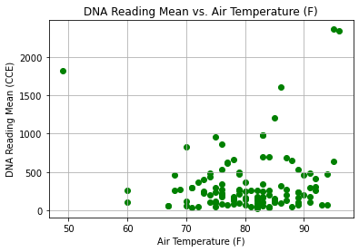
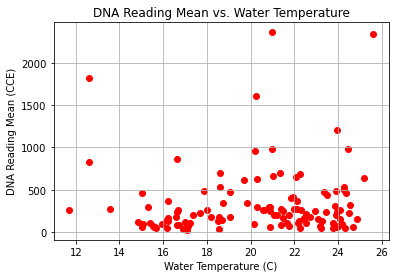
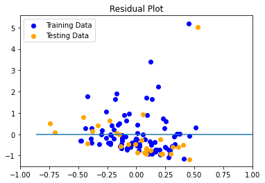

# E. coli Beach Predictions

### Can we use weather data and instances of e. coli to predict the safety of a beach?

Inspired by [these](https://www.chicagoriver.org/issues/policy/climate-change) [articles](https://www.nytimes.com/interactive/2021/07/07/climate/chicago-river-lake-michigan.html) concerning precipitation effects on the Chicago river and Lake Michigan, we set out to predict one serious consequence of a changing climate. By training a machine algorithm to analyze weather data (rainfall, air temperature, and water temperature) and incidence of e. coli in beaches, we hope to better predict how precipitation can affect waterborne diseases as well as protect beachgoers.

### Dataset
1. E Coli Reading Levels: https://data.cityofchicago.org/Parks-Recreation/Beach-Lab-Data/2ivx-z93u
2. Water Temperature: https://water.weather.gov/ahps/
3. Air Temperature / Precipitation: https://www.ncdc.noaa.gov/cdo-web/

### Results
Below is scatter plots of each weather variable to E Coli reading levels:

By joining the three weather variables and the resulting E Coli reading levels into one dataset, we were able to create a linear regression model. Below shows the plot on difference between the model predicted values and the training/test data:

The mean standard error and R2 values for the prediction model is shown below:

### How to Run Code
